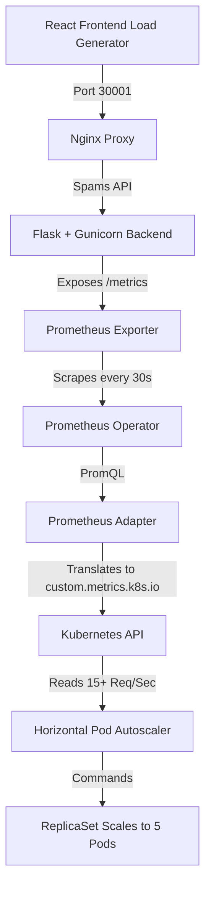

# 🚀 K8s Custom Metrics Autoscaling Engine


A production-grade, containerized microservice architecture demonstrating advanced Kubernetes autoscaling. Instead of relying on standard CPU or Memory metrics, this cluster utilizes a custom metrics pipeline to dynamically scale infrastructure based on **HTTP Requests Per Second**.

## 🏗️ Architecture Overview

The project simulates a real-world traffic spike and automates the infrastructure's response. 



## ⚙️ The Scaling Pipeline

1. **The Load:** The React frontend blasts the Flask backend with concurrent HTTP requests.
2. **The Metric:** The Python application exposes a `flask_http_request_duration_seconds_count` metric.
3. **The Scrape:** The `kube-prometheus-stack` dynamically discovers the backend via a K8s `ServiceMonitor` and scrapes the data.
4. **The Translation:** The Prometheus Adapter calculates the rate over 1 minute and exposes it to the Kubernetes Custom Metrics API as `flask_http_request_per_second`.
5. **The Action:** The HPA continuously monitors the K8s API. When the rate exceeds **15 req/sec per pod**, it immediately provisions new pods to distribute the load. When traffic stops, a custom 60-second stabilization window gracefully spins the pods back down to 1.

---

## 📋 Prerequisites & Environment Setup

This project uses **[Devbox](https://www.jetify.com/devbox)** (powered by Nix) to guarantee reproducible environments. You do not need to manually install `kubectl`, `helm`, or `kind`—Devbox will handle it all for you.

**1. Install Devbox (OS Specific):**

* **Linux / macOS:**
```bash
curl -fsSL https://get.jetify.com/devbox | bash

```


* **Windows:**
You must install and run this from within **WSL2** (Windows Subsystem for Linux). If you don't have WSL2, run `wsl --install` in PowerShell first, then open your WSL terminal and run the curl command above.

**2. Activate the Environment:**
Navigate to the root of this repository and start the shell:

```bash
devbox shell

```

> **Note:** If this is your first time using Devbox, it will automatically prompt you to approve the installation of the **Nix package manager**.
> * On **Linux**, you will be prompted for `sudo` because Nix must create a system-level `/nix` directory.
> * On **macOS**, you will be prompted for `sudo` because Nix must partition a virtual APFS volume to securely isolate the packages.
> 
> 

**3. Ensure Docker is Running:**
Make sure Docker Desktop or the Docker daemon is running on your machine before proceeding.

---

## 🛠️ Quick Start (Local Setup)

### 1. Provision the Cluster

Spin up a local 3-node Kubernetes cluster (1 control-plane, 2 workers) with mapped NodePorts.

```bash
kind create cluster --config=kind-config.yaml

```

### 2. Build & Push Docker Images

```bash
docker buildx build --platform linux/amd64,linux/arm64 -t pradyotc/k8s-obs-frontend:latest ./frontend/
docker buildx build --platform linux/amd64,linux/arm64 -t pradyotc/k8s-obs-backend:latest ./backend/

docker push pradyotc/k8s-obs-frontend:latest
docker push pradyotc/k8s-obs-backend:latest

```

### 3. Deploy the Observability Stack

Install Prometheus, Grafana, and the Custom Metrics Adapter via Helm.

```bash
helm repo add prometheus-community https://prometheus-community.github.io/helm-charts
helm repo update

# Install Prometheus Stack (Grafana exposed on port 30000)
helm install prometheus prometheus-community/kube-prometheus-stack \
  --set prometheus.prometheusSpec.podMonitorSelectorNilUsesHelmValues=false \
  --set prometheus.prometheusSpec.serviceMonitorSelectorNilUsesHelmValues=false \
  --set grafana.service.type=NodePort \
  --set grafana.service.nodePort=30000

# Install the Prometheus Adapter
helm install prometheus-adapter prometheus-community/prometheus-adapter \
  -f k8s/3-adapter-values.yaml \
  --set prometheus.url=http://prometheus-kube-prometheus-prometheus.default.svc.cluster.local \
  --set prometheus.port=9090

```

### 4. Deploy the Application & Autoscaler

```bash
kubectl apply -f k8s/1-apps.yaml
kubectl apply -f k8s/2-monitoring.yaml

```

---

## 📊 Running the Simulation

**1. Watch the Autoscaler in your terminal:**

```bash
kubectl get hpa -w

```

**2. Open the UI:**
Navigate to [http://localhost:30001](http://localhost:30001). Click the **🚀 START Load Test** button.

**3. Watch the Cluster React:**
In your terminal, you will see the `TARGETS` breach the `15` threshold, and Kubernetes will instantly scale the `REPLICAS` from 1 to 5.

**4. View the Grafana Dashboard:**
Navigate to [http://localhost:30000](http://localhost:30000) (Login: `admin` / Password: run `below command`).

```bash
kubectl get secret --namespace default prometheus-grafana -o jsonpath="{.data.admin-password}" | base64 -d ; echo

```

* Import the provided dashboard using the auto-provisioning configmap:

```bash
kubectl create configmap hpa-dashboard --from-file=hpa-dashboard.json=grafana/hpa-dashboard.json
kubectl label configmap hpa-dashboard grafana_dashboard=1

```

* Navigate to the General folder in Grafana. You will see the visual correlation between the incoming HTTP traffic spike and the immediate provisioning of Kubernetes replica pods.

### Clean Up

```bash
kind delete cluster --name devops-capstone
nix-collect-garbage -d

```

---

## 💡 Technical Hurdles Overcome

During development, several complex architectural challenges were resolved:

* **The "Chicken-and-Egg" Custom Metric Problem:** The Prometheus Adapter throws a `NotFound` error if the HPA queries a metric before the application has received its first request. Resolved by jumpstarting the flow to prime the Prometheus database.
* **ServiceMonitor Targeting:** Ensuring the K8s `Service` metadata correctly matches the `ServiceMonitor` labels so the Prometheus Operator can automatically discover and scrape the endpoints without manual configuration.
* **Nginx SPA Routing (Vite):** Resolving 500 Internal Server Errors caused by Nginx failing to properly route Single Page Application internal paths, solved via clean `nginx.conf` root targeting.
* **Kubernetes Image Caching:** Bypassed the `:latest` tag caching trap by strictly defining `imagePullPolicy: Always` to force K8s worker nodes to pull freshly compiled images during debugging rollouts.

---

## 🌍 Cross-Platform Reproducibility ("It Works on My Machine" Solved)

One of the most significant challenges in modern DevOps is the "It works on my machine" anti-pattern, where infrastructure code executes flawlessly on a developer's local laptop but fails catastrophically in cloud environments or shared sandboxes.

This project intentionally completely neutralizes that problem. By leveraging **Devbox** (powered by the Nix package manager), the entire toolchain—including specific versions of `kubectl`, `helm`, and `docker`—is strictly isolated and mathematically reproducible.

Whether this stack is deployed on a macOS laptop running a virtualized Docker `kind` cluster, or a constrained Ubuntu web sandbox like Killercoda/KodeKloud running a bare-metal `kubeadm` cluster, the deployment sequence and scaling behavior remain completely identical.

### 💻 Standardized Execution Logs (Ubuntu / Kubeadm Sandbox)

Below is a condensed output log demonstrating the seamless deployment and automated scaling sequence executed entirely within a remote Linux web sandbox. Because cloud sandboxes often enforce strict network latency and CPU throttling, the HPA threshold in this demonstration was dynamically patched to `5` requests per second to simulate a high-load event within a constrained environment.

```bash
kubectl patch hpa flask-api-hpa --type='json' -p='[{"op": "replace", "path": "/spec/metrics/0/pods/target/averageValue", "value": "5"}]'

```

### Execution Logs

```bash
root@controlplane:~$ kubeadm version
kubeadm version: &version.Info{Major:"1", Minor:"35", EmulationMajor:"", EmulationMinor:"", MinCompatibilityMajor:"", MinCompatibilityMinor:"", GitVersion:"v1.35.1", GitCommit:"8fea90b45245ef5c8ba54e7ae044d3e777c22500", GitTreeState:"clean", BuildDate:"2026-02-10T12:55:17Z", GoVersion:"go1.25.6", Compiler:"gc", Platform:"linux/amd64"}

root@controlplane:~$ kubectl get nodes
NAME           STATUS   ROLES           AGE   VERSION
controlplane   Ready    control-plane   14d   v1.35.1
node01         Ready    <none>          14d   v1.35.1

root@controlplane:~$ git clone -q https://github.com/PradyotC-DevOps/k8s-hpa-prometheus-stack.git

root@controlplane:~$ cd k8s-hpa-prometheus-stack

root@controlplane:~/k8s-hpa-prometheus-stack$ curl -fsSL https://get.jetify.com/devbox | bash
✓ Successfully installed devbox 🚀

root@controlplane:~/k8s-hpa-prometheus-stack$ devbox shell
Nix is not installed. Devbox will attempt to install it.
INFO Step: Provision Nix
INFO Step: Configure Nix
Nix installed successfully. Devbox is ready to use!
Info: Installing the following packages to the nix store: docker@29.6.2, nodejs@24, kubernetes-helm@4.2.3, kubectl@1.36.3, kind@0.32.0
✅ Devbox environment loaded!

(devbox) root@controlplane:~/k8s-hpa-prometheus-stack$ helm install prometheus prometheus-community/kube-prometheus-stack \
  --set prometheus.prometheusSpec.podMonitorSelectorNilUsesHelmValues=false \
  --set prometheus.prometheusSpec.serviceMonitorSelectorNilUsesHelmValues=false \
  --set grafana.service.type=NodePort \
  --set grafana.service.nodePort=30000
NAME: prometheus
STATUS: deployed

(devbox) root@controlplane:~/k8s-hpa-prometheus-stack$ helm install prometheus-adapter prometheus-community/prometheus-adapter -f k8s/3-adapter-values.yaml \
  --set prometheus.url=http://prometheus-kube-prometheus-prometheus.default.svc.cluster.local \
  --set prometheus.port=9090
NAME: prometheus-adapter
STATUS: deployed

(devbox) root@controlplane:~/k8s-hpa-prometheus-stack$ kubectl apply -f k8s/1-apps.yaml && kubectl apply -f k8s/2-monitoring.yaml
deployment.apps/flask-backend created
service/flask-backend created
deployment.apps/react-frontend created
service/react-frontend created
servicemonitor.monitoring.coreos.com/flask-monitor created
horizontalpodautoscaler.autoscaling/flask-api-hpa created

(devbox) root@controlplane:~/k8s-hpa-prometheus-stack$ kubectl get secret --namespace default prometheus-grafana -o jsonpath="{.data.admin-password}" | base64 -d ; echo
KmyKgjDGqVLqY7vfCkbITLpWXxXMqvItyxC75lrq

(devbox) root@controlplane:~/k8s-hpa-prometheus-stack$ kubectl create configmap hpa-dashboard --from-file=hpa-dashboard.json=grafana/hpa-dashboard.json
kubectl label configmap hpa-dashboard grafana_dashboard=1
configmap/hpa-dashboard created
configmap/hpa-dashboard labeled

(devbox) root@controlplane:~/k8s-hpa-prometheus-stack$ kubectl get hpa -w
NAME            REFERENCE                  TARGETS        MINPODS   MAXPODS   REPLICAS   AGE
flask-api-hpa   Deployment/flask-backend   <unknown>/5    1         5         1          89s
flask-api-hpa   Deployment/flask-backend   0/5            1         5         1          2m00s
flask-api-hpa   Deployment/flask-backend   333m/5         1         5         1          4m31s
flask-api-hpa   Deployment/flask-backend   1466m/5        1         5         1          5m32s
flask-api-hpa   Deployment/flask-backend   9700m/5        1         5         1          9m32s
flask-api-hpa   Deployment/flask-backend   9700m/5        1         5         3          9m47s
flask-api-hpa   Deployment/flask-backend   9700m/5        1         5         5          10m02s

```

### ⚙️ Why This Execution Architecture Matters

Including this condensed execution log directly in your repository documentation acts as irrefutable proof of your engineering rigor. It signals to technical recruiters and senior engineering managers that you understand the macro-level goals of infrastructure engineering.

* **Idempotency & Predictability:** The exact same sequence of `helm install` and `kubectl apply` commands yield the exact same architectural state, regardless of the underlying host OS.
* **Dependency Pinning:** By locking binary versions inside `devbox.json` and `devbox.lock`, you eliminate pipeline failures caused by globally installed binary mismatches (e.g., Helm v3 vs. Helm v4 syntax breaking changes).
* **Environmental Agnosticism:** The custom metrics pipeline translates PromQL queries to the `custom.metrics.k8s.io` API universally. The Kubernetes API server does not care if the nodes are provisioned via `kubeadm` on Ubuntu or `kind` on macOS—the HPA reacts exclusively to the metric values, ensuring scaling logic remains completely decoupled from the hardware provisioning layer.