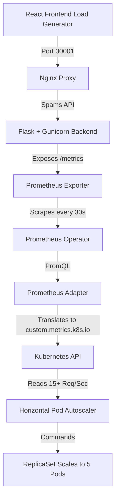

# 🚀 K8s Custom Metrics Autoscaling Engine


A production-grade, containerized microservice architecture demonstrating advanced Kubernetes autoscaling. Instead of relying on standard CPU or Memory metrics, this cluster utilizes a custom metrics pipeline to dynamically scale infrastructure based on **HTTP Requests Per Second**.

## 🏗️ Architecture Overview

The project simulates a real-world traffic spike and automates the infrastructure's response. 



## ⚙️ The Scaling Pipeline

1. **The Load:** The React frontend blasts the Flask backend with concurrent HTTP requests.
2. **The Metric:** The Python application exposes a `flask_http_request_duration_seconds_count` metric.
3. **The Scrape:** The `kube-prometheus-stack` dynamically discovers the backend via a K8s `ServiceMonitor` and scrapes the data.
4. **The Translation:** The Prometheus Adapter calculates the rate over 1 minute and exposes it to the Kubernetes Custom Metrics API as `flask_http_request_per_second`.
5. **The Action:** The HPA continuously monitors the K8s API. When the rate exceeds **15 req/sec per pod**, it immediately provisions new pods to distribute the load. When traffic stops, a custom 60-second stabilization window gracefully spins the pods back down to 1.

---

## 🛠️ Quick Start (Local Setup)

### Prerequisites

* Docker & Docker Buildx
* `kubectl`, `helm`, and `kind` (Easily managed via `devbox shell` or Nix)

### 1. Provision the Cluster

Spin up a local 3-node Kubernetes cluster (1 control-plane, 2 workers) with mapped NodePorts.

```bash
kind create cluster --config=kind-config.yaml

```

### 2. Build & Push Docker Images

```bash
docker buildx build --platform linux/amd64,linux/arm64 -t pradyotc/k8s-obs-frontend:latest ./frontend/
docker buildx build --platform linux/amd64,linux/arm64 -t pradyotc/k8s-obs-backend:latest ./backend/

docker push pradyotc/k8s-obs-frontend:latest
docker push pradyotc/k8s-obs-backend:latest

```

### 3. Deploy the Observability Stack

Install Prometheus, Grafana, and the Custom Metrics Adapter via Helm.

```bash
helm repo add prometheus-community [https://prometheus-community.github.io/helm-charts](https://prometheus-community.github.io/helm-charts)
helm repo update

# Install Prometheus Stack (Grafana exposed on port 30000)
helm install prometheus prometheus-community/kube-prometheus-stack \
  --set prometheus.prometheusSpec.podMonitorSelectorNilUsesHelmValues=false \
  --set prometheus.prometheusSpec.serviceMonitorSelectorNilUsesHelmValues=false \
  --set grafana.service.type=NodePort \
  --set grafana.service.nodePort=30000

# Install the Prometheus Adapter
helm install prometheus-adapter prometheus-community/prometheus-adapter \
  -f k8s/3-adapter-values.yaml \
  --set prometheus.url=[http://prometheus-kube-prometheus-prometheus.default.svc.cluster.local](http://prometheus-kube-prometheus-prometheus.default.svc.cluster.local) \
  --set prometheus.port=9090

```

### 4. Deploy the Application & Autoscaler

```bash
kubectl apply -f k8s/1-apps.yaml
kubectl apply -f k8s/2-monitoring.yaml

```

---

## 📊 Running the Simulation

**1. Watch the Autoscaler in your terminal:**

```bash
kubectl get hpa -w

```

**2. Open the UI:**
Navigate to [http://localhost:30001](http://localhost:30001). Click the **🚀 START Load Test** button.

**3. Watch the Cluster React:**
In your terminal, you will see the `TARGETS` breach the `15` threshold, and Kubernetes will instantly scale the `REPLICAS` from 1 to 5.

**4. View the Grafana Dashboard:**
Navigate to [http://localhost:30000](http://localhost:30000) (Login: `admin` / Password: run `kubectl get secret --namespace default prometheus-grafana -o jsonpath="{.data.admin-password}" | base64 -d ; echo`).

* Import the provided dashboard: `grafana/hpa-dashboard.json`.
* You will see the visual correlation between the incoming HTTP traffic spike and the immediate provisioning of Kubernetes replica pods.

### Clean Up

```bash
kind delete cluster --name devops-capstone
nix-collect-garbage -d

```

---

## 💡 Technical Hurdles Overcome

During development, several complex architectural challenges were resolved:

* **The "Chicken-and-Egg" Custom Metric Problem:** The Prometheus Adapter throws a `NotFound` error if the HPA queries a metric before the application has received its first request. Resolved by jumpstarting the flow to prime the Prometheus database.
* **ServiceMonitor Targeting:** Ensuring the K8s `Service` metadata correctly matches the `ServiceMonitor` labels so the Prometheus Operator can automatically discover and scrape the endpoints without manual configuration.
* **Nginx SPA Routing (Vite):** Resolving 500 Internal Server Errors caused by Nginx failing to properly route Single Page Application internal paths, solved via clean `nginx.conf` root targeting.
* **Kubernetes Image Caching:** Bypassed the `:latest` tag caching trap by strictly defining `imagePullPolicy: Always` to force K8s worker nodes to pull freshly compiled images during debugging rollouts.